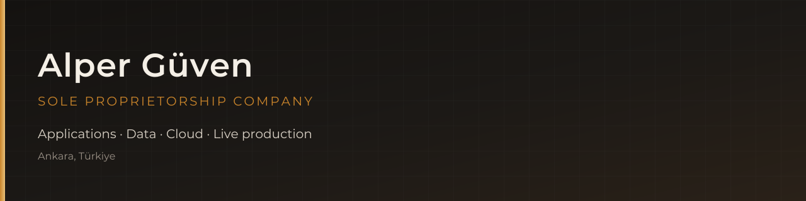

  

 

  

<h1 align="center">Alper Güven</h1>

  <strong>Practical, scalable software</strong> across applications, data, 
  cloud infrastructure, and live production services.

  
  
  

  
  
  

---

## The work

I build practical, scalable software across applications, data, cloud infrastructure, and live production services. I work directly with **banks, financial institutions, fintechs, and businesses across industries**, turning business needs into technical systems that hold up in production.

The practice covers **SaaS**, **OCR and document processing**, **cloud platforms**, **APIs**, and **music-related applications** — from first design decisions through deployment, operations, and ongoing change.

I take a product from UI to a running service: plan the work, design the interface with UX in mind, build the frontend and backend, and ship it to a Linux host or a cloud account. That same span is how I keep business, design, engineering, DevOps, and test talking to each other instead of handing work over a wall.

---

## What I take on

<table>
  <tr>
    <td width="50%" valign="top">
      <h3> Applications</h3>
      Web products, internal tools, and multi-tenant SaaS / PaaS — including SSO and RBAC — built so teams can actually run them.
    </td>
    <td width="50%" valign="top">
      <h3> Data & documents</h3>
      OCR, table extraction, and document pipelines that turn messy files into structured data APIs teams can trust.
    </td>
  </tr>
  <tr>
    <td width="50%" valign="top">
      <h3> Cloud infrastructure</h3>
      AWS and Azure environments with Docker, Kubernetes, CI/CD, and infrastructure as code — plus the networking, IAM, and DNS around them.
    </td>
    <td width="50%" valign="top">
      <h3> Live production</h3>
      APIs, caching, monitoring, and third-party integrations kept healthy after launch — not just demoed once.
    </td>
  </tr>
</table>

---

## Who it is for

| Finance | Industry | Product |
| :---: | :---: | :---: |
|  Banks & financial institutions |  Businesses across industries |  Music-related applications |
| Stock analysis platforms, scoring, and bank-facing delivery | SaaS, e-commerce, and custom systems that match how the business actually works | Product and platform work where audio, catalogs, and user experience meet |

---

## How delivery looks

- **End-to-end ownership** — UI, frontend, backend, and the path to production, not a single layer in isolation
- **Platforms that scale** — multi-tenant systems, service boundaries, and APIs that other products can sit on
- **Cloud that is operable** — AWS (IAM, EC2, S3, CloudFront, VPC, ELB, Secrets Manager) and Azure, with GitHub Actions and IaC
- **Document intelligence** — ML-assisted OCR and extraction services for real document workflows
- **Production discipline** — Redis / Valkey, monitoring, and the unglamorous work that keeps a service up

---

## Stack

  

Also in regular use: **Nx** monorepos, **Sentry**, CloudFormation / YAML IaC, and on-prem or private-cloud setups when a public cloud is not the right fit.

---

## Open source

Libraries for the unsexy part of production systems — consistent cache keys.

| Package | What it does |
| --- | --- |
| [create-redis-key](https://www.npmjs.com/package/create-redis-key) | Typed Redis key templates from a nested config, so keys stay consistent across a codebase |
| [valkeygen](https://github.com/alper-guven/valkeygen) | Valkey key generation utility, aimed at becoming a fuller key/ORM layer |

---

## Talk to me

If you have a product to ship, a platform to stabilize, or a document/data problem that needs a real service around it — [write on LinkedIn](https://www.linkedin.com/in/alperguven/).

  <a href="https://www.linkedin.com/in/alperguven/">LinkedIn</a>
  ·
  <a href="https://github.com/alper-guven">GitHub</a>
  ·
  <a href="https://alperguven.company">alperguven.company</a>
  ·
  <a href="https://dev.to/alperguven">DEV</a>

